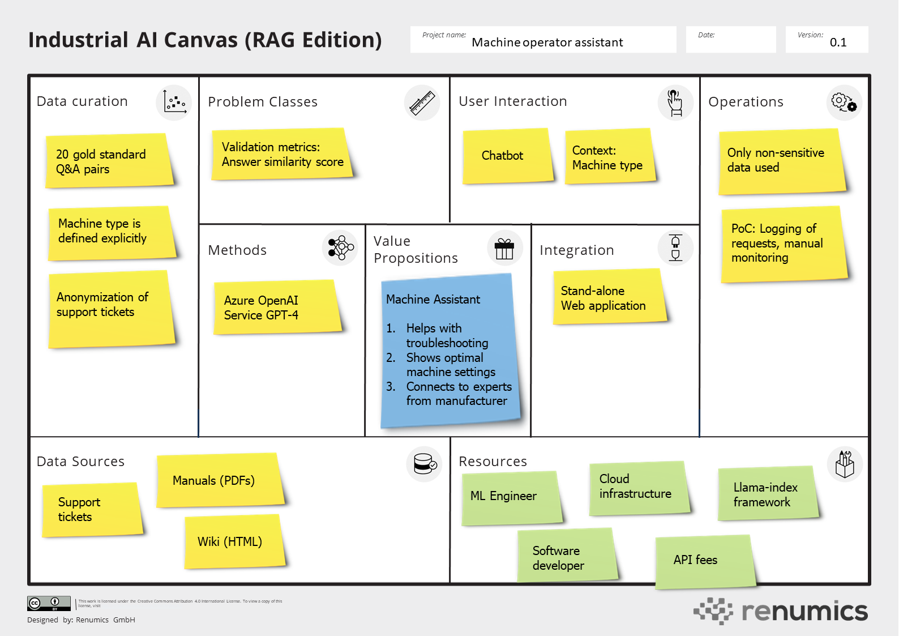
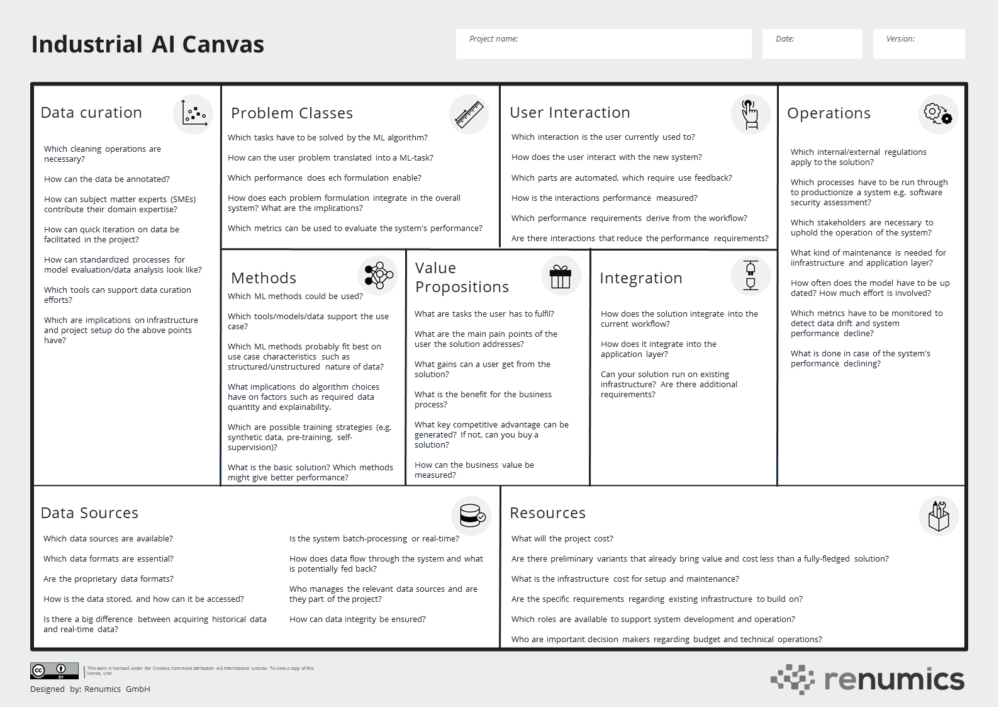
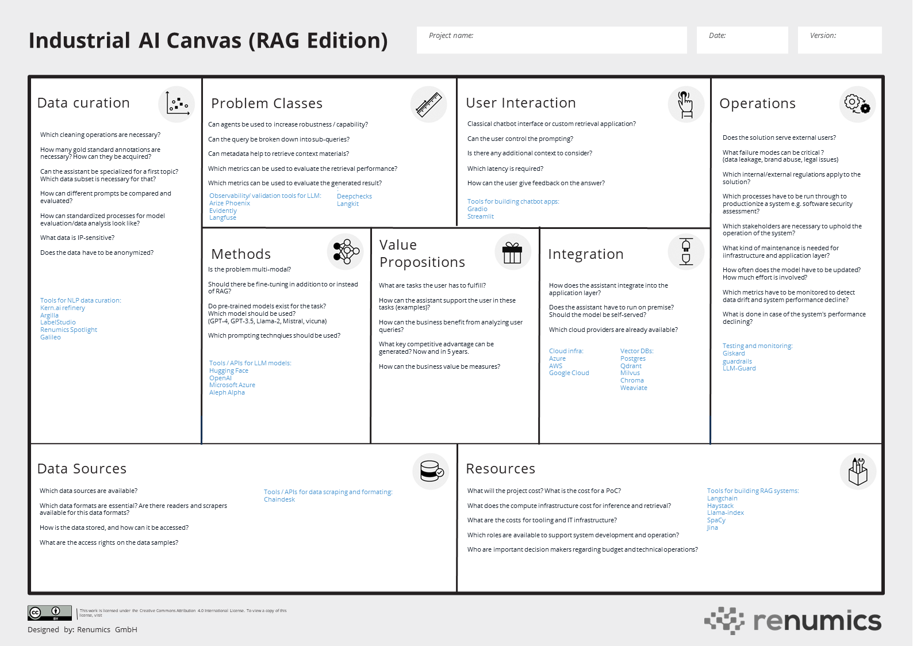

<h1 align="center">The industrialAI Canvas</h1>

🏭 Collaboratively ideate, iterate and build ML-based solutions for industrial applications.

The **industrial AI canvas** is a tool to conceptualize ML-based systems. It is inspired by the Alex Osterwalder's business model canvas. The industrial AI canvas helps cross-functional teams to quickly map out ML-based solutions. 

👐 If you have any feedback on the canvas or if you feel a tool is missing, please open an issue or join our [Discord](https://discord.gg/VAQdFCU5YD)

## Blank version of the industrial AI canvas

## Blank version of the industrial AI canvas (RAG edition)

